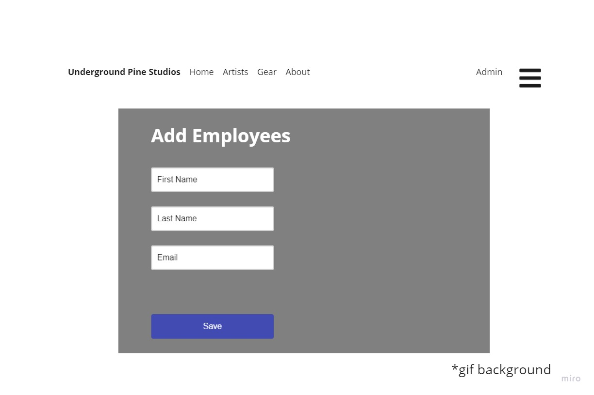

# studio-manager-mvc

Author: Quinn Allan Siebers 
 
Date: 8-17-22

Hello! Welcome to my recording studio manager application! This is a simple app where a studio (user) can create, read, update, and delete a list of artists that they have worked with. The app has a few more features that I will demonstrate with wireframes.

## Landing Page
This is the first thing you see when you load the application, simple layout with title, image, & nav bar up top.

## Artist Page

One of the main functions of this app is the ability to read, update, and delete the artists that this studio has worked with

Here is an example of the form to add/edit an artist

## Employees & Security

The way I implemented security is that I added an admin login that protects the employee list CRUD
This is the About page with an Employee table, notice there is not CRUD functionality

On the top right of the Nav Bar there is an Admin button, when pressed it will take you to the admin login

Once authenticated you will have full CRUD functionality to modify the employees table however you see fit.

